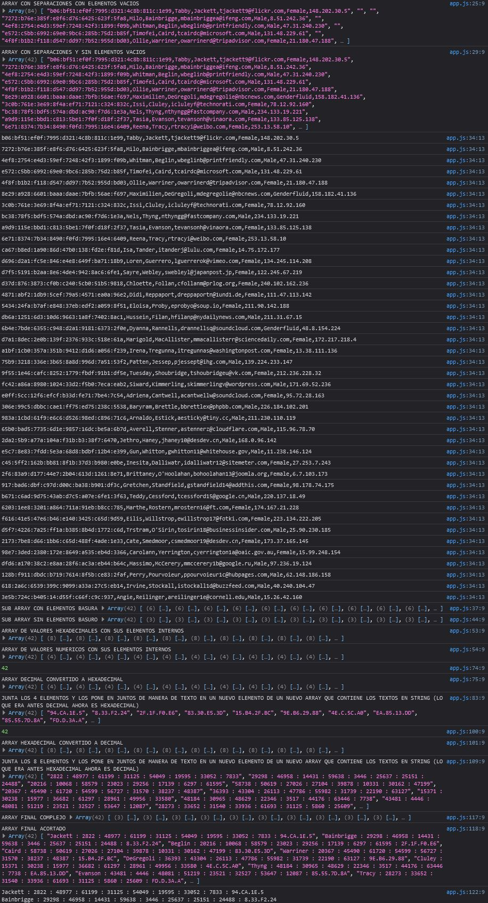
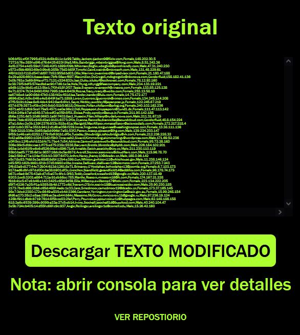

👋 Welcome! 👋 

## Table of contents

  - [ejercicio](#ejercicio) ❔
  - [Screenshot](#screenshot) 📷
  - [Links](#links) 🔗
  - [Built with](#built-with) 🔨
  - [Author](#author) 👽

### ejercicio

Vamos a procesar por lotes un archivo con el siguiente formato. Ejemplo:
b06:bf51:ef0f:7995:d321:4c8b:811c:1e99, Tabby, Jackett, tjackett9@flickr.com, Female, 148.202.30.5 

Los primeros números están en hexadecimal -> convertirlos a decimal
DECIMAL : DECIMAL : DECIMAL : DECIMAL : DECIMAL : DECIMAL : DECIMAL : DECIMAL :

Eliminar las cadenas de texto y solo nos quedamos con la SEGUNDA CADENA de texto.
Convertir a hexadecimal (letras en mayúscula) los últimos 4 datos: 148.202.30.5 
148 = 94
202 = CA
30 = 1E
5 = 5

Reescribir en el archivo de salida con el siguiente formato:
Primero: la segunda cadena. 
Segundo: los números en decimal.
Tercero: los números en hexadecimal.

Ejemplo:
b06:bf51:ef0f:7995:d321:4c8b:811c:1e99,Tabby,Jackett,tjackett9@flickr.com,Female,105.18.162.229

Resultado:
Jackett : 2822 : 48977 : 61199 : 31125 : 54049 : 19595 : 33052 : 7833 : 94.CA.1E.5 

### Screenshot

### Links 

🔗 Live Site URL: [https://sistemas-operativos-practica-2.netlify.app/](https://sistemas-operativos-practica-2.netlify.app/)

### Built with 

🔨 Semantic HTML5 markup

🔨 CSS custom properties

🔨 JavaScript

## Author 

👽 Netlify - [Alan](https://app.netlify.com/teams/alan77777777/overview)

👽 GitHub - [Alan77777777](https://github.com/Alan77777777)

👽 Frontend Mentor - [@Alan77777777](https://www.frontendmentor.io/profile/Alan77777777)

## Table of contents

  - [ejercicio](#ejercicio) ❔
  - [Screenshot](#screenshot) 📷
  - [Links](#links) 🔗
  - [Built with](#built-with) 🔨
  - [Author](#author) 👽

Note: Check console!